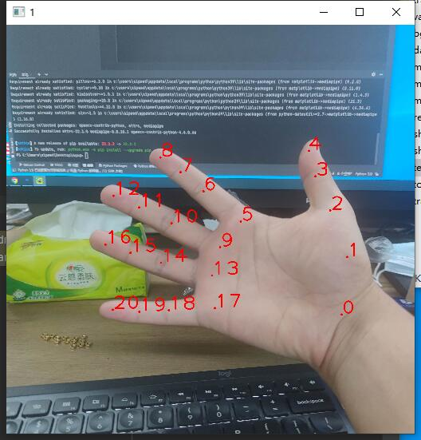

手部21关键点检测

点的标注如图所示，这个模型训练结果目前只对手部居中的情况有效，离开视野基本没有效果。

输入（128，128，3）的图片，输入42reshape成（21，2）个点的坐标

文件说明
-
- dataloader 创建dataset，先通过loadlist函数加载所有文件的名称，然后创建数据集，再通过map函数读取文件进行增强和归一化
- dataaug 测试数据增强并展示效果，使用torchlm库
- Flops 计算模型的运算量（tensoflow用，torch用flops库）
- json2npy 原始数据集是json保存的标签，这个用来解析并生成数组保存
- model 模型文件
- train test 训练测试样本，quanttest为量化模型的测试
- squeezenet 使用tensorflow复现
- utils l2损失肾么的
- writelist 把训练集写入txt以在dataset里读取

